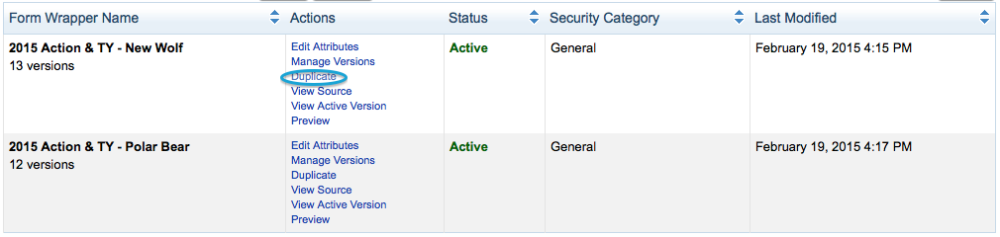
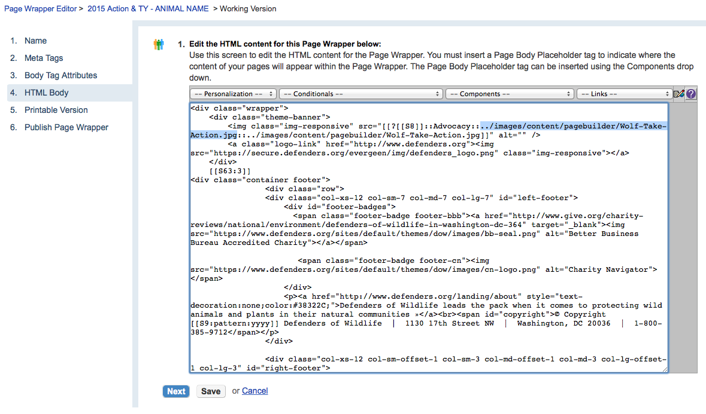

# DOW_Resp_Forms
Documentation on how to replicate the new 2014 DOW action and donation forms
##Action Alerts
1. There are two example action alerts that can be duplicated for production (2015 Wolf and 2015 Polar Bear).
2. The Action Alert redirects to Thank You Pagebuilder pages upon completion (2015_Alert_Thank_You_Wolf and 2015_Alert_Thank_You_Polar_Bear). 
3. Both the action alerts and the pagebuilder thank you pages use the same page wrapper (2015 Action & TY Wolf and 2015 Action & TY Polar Bear).
###Creating a New Action Alert Version (new animal)
If you want to create a new version (e.g. new animal banner), you must duplicate the page wrapper and replace the banner image in two places.
1. Click Setup > Page Wrapper Editor > Search 2015 Action & TY > Duplicate one of wrappers (2015 Action & TY Wolf or 2015 Action & TY Polar Bear) > Name it with a description of the new banner.   
2. Next, go to the most recently published version (to check this you can sort by last modified on the wrapper you copied from) and edit the version.
3. Go to step 4. HTML Body. Here, you will replace the banner image (1100x288) in the two highlighted locations below. Keep in mind that when the banner is resized for tablet/mobile, the right half of the image is used. Make sure the banner is designed appropriately.  .
4. Publish the version of the wrapper.
5. Go to the edit section of the Action Alert you wish to apply this new banner to, click 9. Design Alert and update the page wrapper in step 1. Please note that if you do not see the wrapper you just created, you may have to log out of convio and then log back in for the wrapper to appear.
